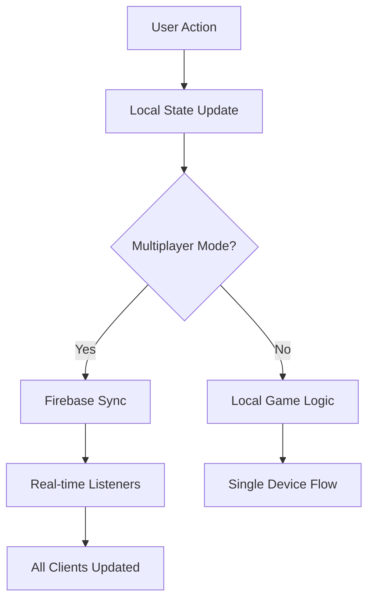
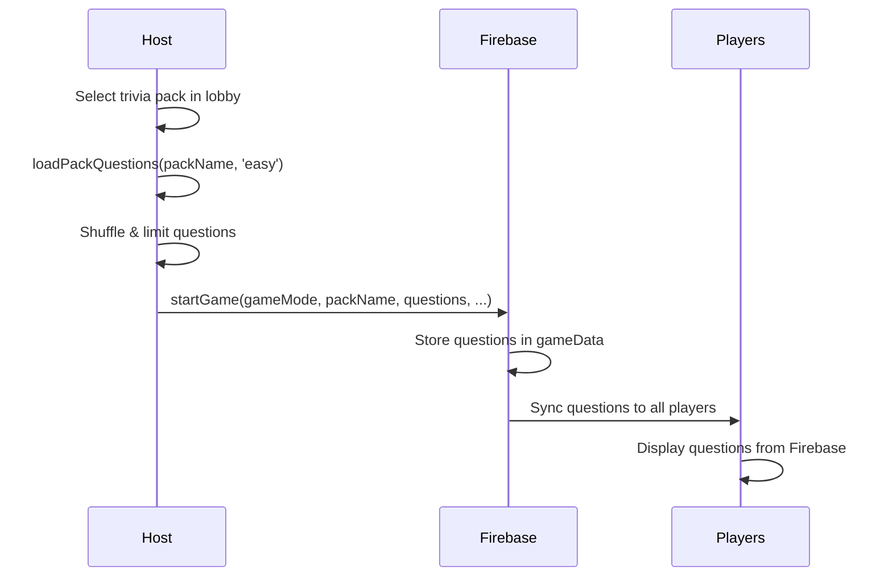
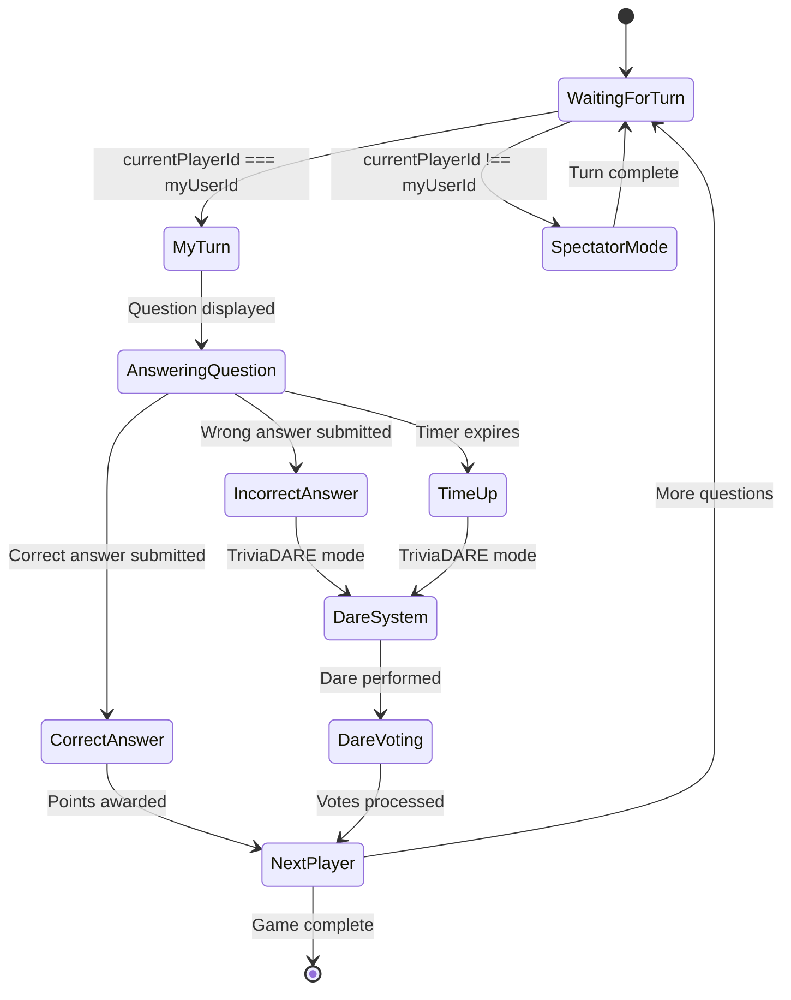
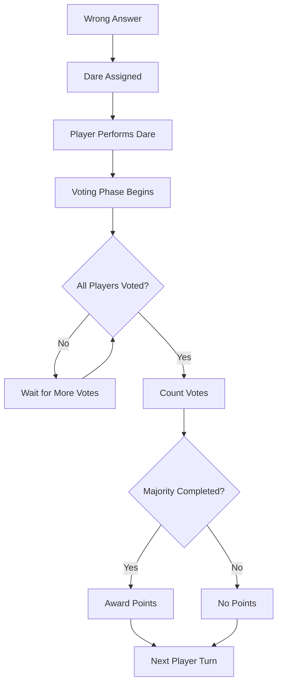
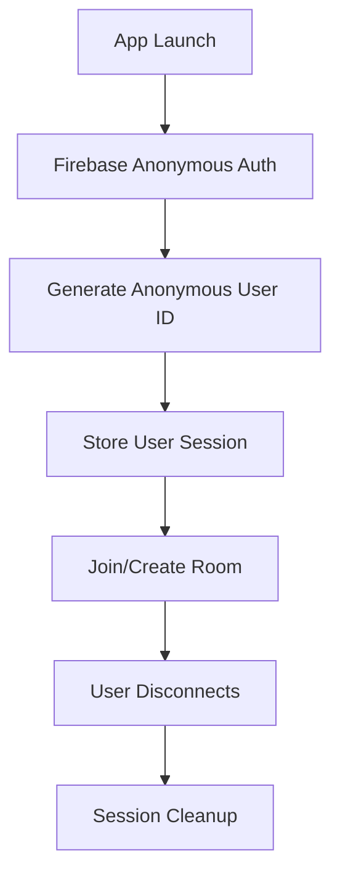

# TriviaDare Technical Architecture

## 🏗️ System Overview

TriviaDare is built as a real-time multiplayer React Native application using Firebase as the backend infrastructure. The architecture prioritizes low-latency gameplay, cross-platform compatibility, and scalable multiplayer experiences.

## 🧩 Core Architecture Principles

### 1. **Real-time First**
- All game state synchronized via Firebase Realtime Database
- Sub-500ms latency for turn transitions
- Optimistic UI updates with fallback handling

### 2. **Cross-Platform Compatibility**
- Platform-specific optimizations (iOS/Android)
- Consistent user experience across devices
- Native performance with React Native

### 3. **Scalable Multiplayer**
- Room-based architecture supporting 2-8 players
- Anonymous authentication for zero-friction onboarding
- Efficient Firebase usage within free tier limits

### 4. **State Management Strategy**
- React Context for local game state
- Firebase Realtime Database for multiplayer synchronization
- Optimistic updates with conflict resolution

## 🔥 Firebase Architecture

### Database Structure

```javascript
// Root level
{
  rooms: {
    "A1B2": {
      // Room metadata
      roomCode: "A1B2",
      hostId: "user123",
      createdAt: "2024-01-15T10:30:00.000Z",
      gameStatus: "playing", // waiting | playing | finished
      
      // Game configuration
      gameSettings: {
        timeLimit: 30,        // 15, 30, 45, 60 seconds
        rounds: 5,            // 1-20 questions
        gameMode: "TriviaDARE" // TriviaDARE | TriviaONLY
      },
      
      // Game data and questions
      gameData: {
        gameMode: "TriviaDARE",
        packName: "Entertainment",
        packId: "entertainment",
        packDisplayName: "Entertainment",
        questions: [
          {
            "Question ID": "ENT001",
            "Question Text": "What movie won Best Picture in 2020?",
            "Option A": "Parasite",
            "Option B": "1917", 
            "Option C": "Joker",
            "Option D": "Once Upon a Time in Hollywood",
            "Correct Answer": "Option A",
            "Difficulty": "Easy"
          }
          // ... more questions
        ],
        timeLimit: 30,
        rounds: 5,
        totalQuestions: 5,
        createdAt: "2024-01-15T10:30:00.000Z"
      },
      
      // Game state
      currentQuestionIndex: 0,
      currentPlayerId: "user456", // Whose turn it is
      
      // Players
      players: {
        "user123": {
          id: "user123",
          name: "Alice",
          isHost: true,
          isConnected: true,
          platform: "ios",
          score: 350,
          ready: true,
          joinedAt: "2024-01-15T10:30:00.000Z"
        },
        "user456": {
          id: "user456", 
          name: "Bob",
          isHost: false,
          isConnected: true,
          platform: "android", 
          score: 275,
          ready: true,
          joinedAt: "2024-01-15T10:30:15.000Z"
        }
      },
      
      // Dare system (TriviaDARE mode only)
      currentDare: {
        playerId: "user456",
        text: "Sing 'Happy Birthday' in opera style",
        timestamp: "2024-01-15T10:35:00.000Z",
        pointValue: 285, // Dynamically calculated
        inProgress: true
      },
      
      dareVotes: {
        "user123": true,  // Host voted completed
        "user789": false, // Player voted not completed
        "user101": true   // Player voted completed
      },
      
      // Coordination
      countdown: {
        value: 3,
        startTimestamp: "2024-01-15T10:34:45.000Z",
        inProgress: true
      },
      
      // Answer tracking
      answers: {
        "0": { // Question index
          "user456": {
            playerId: "user456",
            answer: "Parasite",
            isCorrect: true,
            timestamp: "2024-01-15T10:35:12.000Z"
          }
        }
      }
    }
  }
}
```

### Security Rules

```javascript
{
  "rules": {
    "rooms": {
      ".read": "auth != null",
      ".write": "auth != null",
      "$roomId": {
        ".read": "auth != null",
        ".write": "auth != null",
        "players": {
          "$playerId": {
            ".read": "auth != null",
            ".write": "auth != null || $playerId === auth.uid"
          }
        }
      }
    }
  }
}
```

## 📱 Client Architecture

### Component Hierarchy

```
App
├── NavigationContainer
│   ├── HomeScreen
│   ├── ConnectionScreen (Multiplayer entry)
│   ├── LobbyScreen (Game setup)
│   ├── MultiplayerQuestionScreen (Gameplay)
│   ├── TriviaPackSelection
│   └── WinnerTransition (Results)
│
├── Context Providers
│   ├── GameProvider (Local state)
│   ├── FirebaseProvider (Multiplayer state)
│   └── SettingsProvider (User preferences)
│
└── Components
    ├── QuestionContainer
    ├── DarePopup  
    ├── ScoreBanner
    └── Shared UI Components
```

### State Management Flow



### Context Architecture

#### GameContext.js
```javascript
// Local game state management
const GameContext = {
  // Player management
  players: string[],
  scores: number[],
  currentPlayerIndex: number,
  
  // Question system  
  questions: Question[],
  currentQuestion: Question,
  currentQuestionIndex: number,
  
  // Game configuration
  selectedPack: string,
  timeLimit: number,
  numberOfQuestions: number,
  
  // Dare system
  performingDare: boolean,
  dareStreaks: number[],
  
  // Timer configuration
  TIMER_CONFIGS: {
    15: { label: 'Quick', baseScore: 200 },
    30: { label: 'Standard', baseScore: 150 },
    45: { label: 'Relaxed', baseScore: 100 },
    60: { label: 'Extended', baseScore: 50 }
  },
  
  // Dynamic dare scoring
  calculateDarePoints: (playerIndex, currentScores, totalQuestions) => number,
  updateDareStreak: (playerIndex, completed) => void,
  getDareStreakInfo: (playerIndex) => StreakInfo
}
```

#### FirebaseContext.js
```javascript
// Multiplayer state and operations
const FirebaseContext = {
  // Authentication
  user: User,
  isLoading: boolean,
  isConnected: boolean,
  
  // Room management
  currentRoom: string,
  players: {[userId]: PlayerData},
  gameState: GameState,
  
  // Room operations
  createRoom: (playerName, gameSettings) => Promise<string>,
  joinRoom: (roomCode, playerName) => Promise<string>,
  leaveRoom: () => Promise<void>,
  
  // Game operations
  startGame: (gameMode, packName, questions, timeLimit, rounds) => Promise<void>,
  updateGameState: (updates) => Promise<boolean>,
  updatePlayerData: (updates, playerId?) => Promise<boolean>,
  
  // Answer system
  submitAnswer: (answer, isCorrect) => Promise<boolean>,
  
  // Dare system
  generateAndSetDare: () => Promise<string>,
  submitDareVote: (isCompleted) => Promise<boolean>,
  processDareVotes: () => Promise<boolean>,
  
  // Utilities
  getLeaderboard: () => PlayerData[],
  isHost: boolean
}
```

## 🔄 Game Flow Architecture

### Question Loading System



### Turn-Based Gameplay



### Dare Voting System



## ⚡ Performance Optimizations

### Firebase Optimization

1. **Efficient Listeners**
   ```javascript
   // Only listen to active room
   useEffect(() => {
     if (!currentRoom) return;
     
     const roomRef = ref(database, `rooms/${currentRoom}`);
     const unsubscribe = onValue(roomRef, handleRoomUpdate);
     
     return unsubscribe; // Cleanup on unmount
   }, [currentRoom]);
   ```

2. **Batched Updates**
   ```javascript
   // Batch multiple updates
   await update(roomRef, {
     gameStatus: 'playing',
     currentQuestionIndex: 0,
     gameData: gameDataWithQuestions
   });
   ```

3. **Optimistic UI**
   ```javascript
   // Update UI immediately, sync with Firebase
   setLocalScore(newScore);
   firebase.updatePlayerData({ score: newScore });
   ```

### React Native Optimization

1. **Memoized Components**
   ```javascript
   const QuestionContainer = memo(({ question, onAnswer }) => {
     // Prevent unnecessary re-renders
   });
   ```

2. **Native Driver Animations**
   ```javascript
   Animated.timing(value, {
     toValue: 1,
     duration: 300,
     useNativeDriver: true // Runs on UI thread
   }).start();
   ```

3. **Platform-Specific Code**
   ```javascript
   const styles = StyleSheet.create({
     button: {
       ...Platform.select({
         ios: { shadowColor: '#000' },
         android: { elevation: 5 }
       })
     }
   });
   ```

## 🔐 Security Architecture

### Authentication Flow


### Data Validation

1. **Client-Side Validation**
   ```javascript
   const validateRoomCode = (code) => {
     return /^[A-Z0-9]{4}$/.test(code);
   };
   
   const validatePlayerName = (name) => {
     return name.length >= 1 && name.length <= 15;
   };
   ```

2. **Firebase Security Rules**
   ```javascript
   // Only authenticated users can read/write
   ".read": "auth != null",
   ".write": "auth != null"
   
   // Players can only modify their own data
   "$playerId": {
     ".write": "auth != null || $playerId === auth.uid"
   }
   ```

## 📊 Monitoring & Analytics

### Performance Metrics
- **Turn Transition Latency**: <500ms target
- **Firebase Reads**: <45K/day (free tier)
- **Firebase Writes**: <22K/day (free tier)
- **Concurrent Users**: 100-150 supported
- **Memory Usage**: <100MB per device

### Error Tracking
```javascript
// Firebase connection errors
const handleFirebaseError = (error) => {
  console.error('Firebase Error:', error);
  // Report to analytics service
  Analytics.reportError('firebase_connection', error);
};

// Game state sync errors  
const handleSyncError = (error) => {
  console.error('Sync Error:', error);
  // Attempt recovery
  attemptStateRecovery();
};
```

### Key Metrics to Track
- Room creation success rate
- Player join success rate  
- Game completion rate
- Average game duration
- Dare completion percentage
- Cross-platform usage

## 🧪 Testing Architecture

### Unit Testing
```javascript
// Game logic tests
describe('calculateDarePoints', () => {
  it('should calculate base points correctly', () => {
    const points = calculateDarePoints(0, [100, 200], 5);
    expect(points).toBeGreaterThan(0);
  });
});

// Firebase integration tests
describe('FirebaseContext', () => {
  it('should create room successfully', async () => {
    const roomCode = await createRoom('TestPlayer', settings);
    expect(roomCode).toMatch(/^[A-Z0-9]{4}$/);
  });
});
```

### Integration Testing
```javascript
// End-to-end multiplayer flow
describe('Multiplayer Game Flow', () => {
  it('should complete full game cycle', async () => {
    // 1. Create room
    // 2. Join players  
    // 3. Start game
    // 4. Answer questions
    // 5. Complete game
    // 6. Show results
  });
});
```

### Performance Testing
```javascript
// Load testing for Firebase
const testConcurrentRooms = async () => {
  const promises = [];
  for (let i = 0; i < 50; i++) {
    promises.push(createRoom(`TestPlayer${i}`, settings));
  }
  await Promise.all(promises);
};
```

## 🔮 Scalability Considerations

### Firebase Scaling
- **Horizontal Scaling**: Rooms are independent, naturally scalable
- **Regional Databases**: Can deploy to multiple regions
- **Caching Layer**: Add Redis for frequently accessed data
- **Load Balancing**: Firebase handles automatically

### Client Scaling  
- **Code Splitting**: Lazy load screens and components
- **Asset Optimization**: Compress images and sounds
- **Bundle Optimization**: Platform-specific builds
- **Memory Management**: Proper cleanup and garbage collection

### Future Architecture Enhancements
1. **Microservices**: Split game logic into independent services
2. **WebSocket Alternative**: Custom real-time server if Firebase limits reached
3. **CDN**: Global content delivery for assets
4. **Analytics Pipeline**: Real-time game analytics processing

---

This architecture supports the current feature set while providing a foundation for future enhancements and scale.
